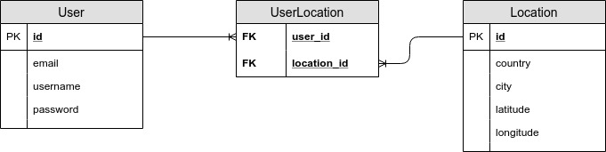

# weathered_back

This is the backend of a weather web application. You can find the frontend [here](https://github.com/romain-ngo/weathered_front).

- [weathered_back](#weatheredback)
  - [Folder structure](#folder-structure)
  - [Prerequisite](#prerequisite)
  - [Launch app](#launch-app)
  - [Application factory](#application-factory)
  - [Database](#database)
    - [Database schema](#database-schema)
    - [ORM](#orm)
  - [Authentication](#authentication)
  - [Technology and framework](#technology-and-framework)
    - [Built with](#built-with)
  - [API](#api)
    - [User](#user)
    - [Location](#location)

## Folder structure

- application/: where the flask application lives
  - \_\_init\_\_.py: entry point of the app. this is where we initialize the lugins, register the blueprints and create the app.
  - location/: location blueprint
  - user/: user blueprint
- img/: contains various img (mostly for readme)
- .env: environment variables (**never commit this file to a repository**)
- .gitignore: the files and folders that should not be committed
- config.py: configuration file of the application
- Pipfile: pipenv dependency file
- start.sh: bash script setting the environment and start the application (run `sh start.sh`)
- wsgi.py: the starting file

## Prerequisite

This project uses `pipenv` as a package manager.

1. Enable the virtual environment (if it is the first time you run this command, a new virtual environment will be created): `pipenv shell`
2. Install the dependencies: `pipenv install`
3. Create a `.env` file in the root folder and set the following variables:

```.env
TESTING=True | False
FLASK_DEBUG=True | False (print error message)
SECRET_KEY=string
DB_DIALECT=sqlite | postgresql | mysql | many more
DB_FILE=name_of_the_database_file
DB_TRACK_MODIFICATIONS=True | False
JWT_SECRET=string (__use a complex, long and randomly generated string__)
```

**/!\\ Add `.env` to `.gitignore` and make sure it is never committed /!\\**

## Launch app

1. You can start the flask application by starting the bash script `start.sh` located in the root folder by running:

```bash
sh start.sh
```

You can also run the application manually with the following commands:

```bash
export FLASK_APP = wsgi.py
export FLASK_ENV=development
flask run
```

In either case, make sure to change the variables depending on the needs.
The application will run on port 5000 by default.

## Application factory

The structure of this flask application is based on the application factory.  
The entry point of the application is `wsgi.py`. This file will call the **init**.py located in the `application/` folder.  
The application make use of blueprints in order to separate each sub application into their own module.

## Database

### Database schema



The database is made of two tables: User and Location. Due to the many-to-many relationship of these two tables, a join table had to be created.

### ORM

This application uses flask-sqlalchemy in order to connect to a database.  
Flask-sqlalchemy is a powerful ORM (Object Relationnal Mapper) giving us the ability to change dialects easily.  
We use SQLite in a development environment but make sure to a more suitable RDBMS such as PostgreSQL in a production environment.  
The configuration is done in `config.py` but the values are set in `.env`

## Authentication

This application uses JWT for authentication.  
When a user successfully authenticates from the backend, two JSON Web Tokens will be sent back: an access token and a refresh token.  
The access token has a short expiration date whereas the refresh token has a long one.  
Only use the access token for accessing a protected route.  
Whenever the access token is expired, use the refresh token to get a new access token.  
By default, the access token and the refresh token have an expiration date of respectively 15 minutes and 30 days.  
These values can be changed by setting the following variables `JWT_ACCESS_TOKEN_EXPIRE` and `JWT_REFRESH_TOKEN_EXPIRE`.  
Please have a look at the [official documentation](https://flask-jwt-extended.readthedocs.io/en/stable/index.html) for more information.  
The tokens must be appended to a request in the authorization header in order to access the protected resources.

## Technology and framework

### Built with

- python 3
- flask: lightweight web framework
- flask-sqlalchemy: ORM flask extension adding sqlalchemy to the application
- python-dotenv: loading environment variable form a .env file
- flask-bcrypt: flask extension providing hashing utilities
- flask-jwt-extended: flask extension adding support for JSON Web Token
- flask-marshmallow: flask extension integrating object serialization
- flask-cors: flask extension handling all cors related issues

## API

### User

- Add new user: `POST /user`  
  body:

```json
{
  "email": "string",
  "username": "string",
  "password": "string"
}
```

- Edit a user (access jwt required): `PUT /user/:id`  
  body:

```json
{
  "id": "integer",
  "email": "string (optional)",
  "username": "string (optional)",
  "currentPassword": "string (optional)",
  "newPassword": "string (mandatory if currentPassword specified)"
}
```

- Add a location to a user (access jwt required): `POST /user/:userId/location`  
  body:

```json
{
  "locationId": "integer
}
```

- Log in: `POST /login`  
  body:

```json
{
  "email": "string",
  "password": "string"
}
```

- Refresh access token (refresh jwt required): `GET /refresh`  
  _Access token appended in authorization headed_

### Location

- Add new location (access jwr required): `POST /location`  
  body:

```json
{
  "id": "integer",
  "country": "string",
  "city": "string",
  "latitude": "integer",
  "longitude": "integer"
}
```
